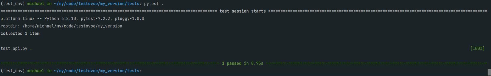
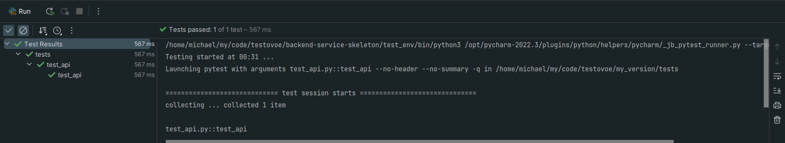

## Быстрый старт

#### 1. Add your postgres database credentials to [config.py](app/config.py)

#### 2. Create database `balance`

```commandline
psql -c "create database balance"
```
> It is better to create role and add privileges to work with this database

#### 3. Run [deploy.sh](deploy.sh)

```commandline
chmod u+x deploy.sh && . ./deploy.sh
```
. . . or you can do it manually:

#### 4. Create virtual environment

_as for me, it was:_
```commandline
python3.8 -m venv test_env
```
#### 5. Activate virtual environment

```commandline
. ./test_env/bin/activate
```

#### 6. Build the package with pip

```commandline
pip install -e .
```

#### 6. Migrate database
```commandline
alembic upgrade head
```

#### 7. Run application

```commandline
run_app
```

## Дополнительно

### Ответы:

1) Требование к быстродействию. Любое обращение к базе данных - затраченное время. В случае не оптимизированного запроса к бд - соседние сервисы будут просто "простаивать"
2) Уведомление рекламного движка возможно:
   1) добавлением в [startups](app/startups) хука, запускающего этот движок
   2) отправкой запроса непосредственно в одном из хендлеров, например, [`get_user_balance.py`](app/api/routes.py)
3) Для контроля качества работы сервиса я бы написал `.yaml`:
   1) [pyright](https://github.com/microsoft/pyright) или `flake8` или `mypy`
   2) `ci/cd`
   3) Добавил бы юнит-тестов для разных кейсов
   4) Интеграционные тесты

* [X] учесть, что сервис будет запускаться в k8s.
* [X] учесть, что архитектура должна гарантировать обработку транзакции ровно 1 раз.
* [X] описать (можно не реализовывать), как можно реализовать уведомление других сервисов о транзакциях.
* [X] тезисно перечислить, какие инструменты можно применить для контроля качества работы сервиса
* [X] гарантировать, что баланс пользователя не может быть отрицательным

____

На всякий случай прикрепляю скриншоты, что тестики у меня прошли =)

One



Two

